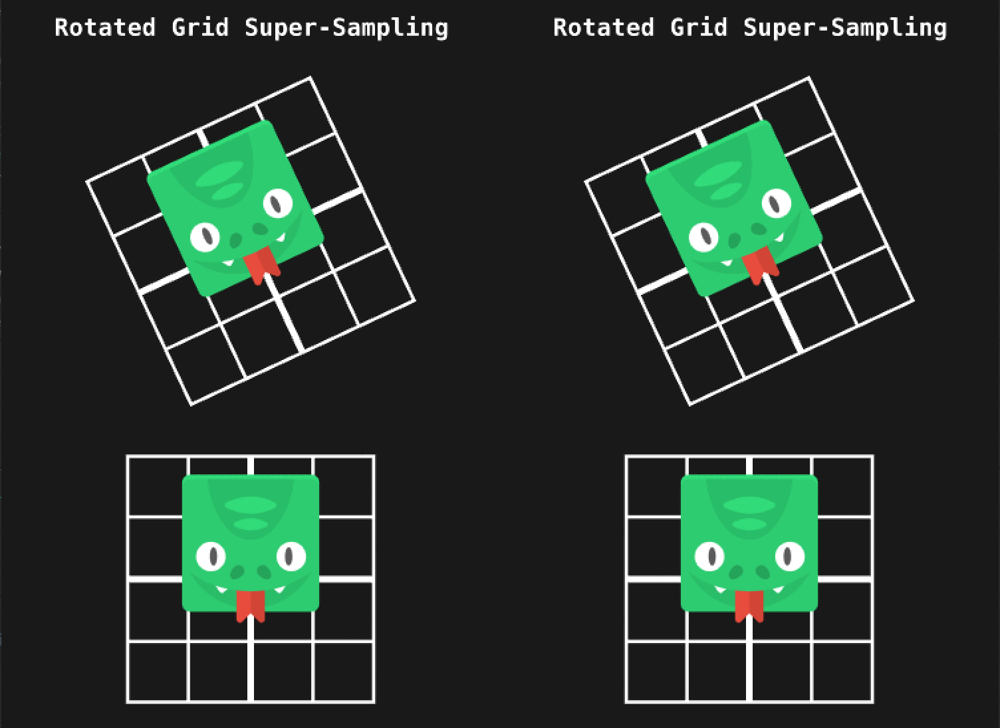

# Sharp Sprite - RGSS for Defold

Sharp Sprite is the implementation of *Rotated Grid Super-Sampling (RGSS)* for the [Defold](https://defold.com/) engine. If you use down-scaled high-resolution images in your game and you want to get rid of blurriness (because of mipmapping) or sharpness (because of disabled mipmapping), then RGSS is for you:

How does it work? RGSS samples the texture multiple times with an offset on each sample and average the results. For this, it uses a 4x MSAA rotated grid pattern, sometimes called 4 rooks.

## Installation

You can use it in your own project by adding this project as a [Defold library dependency](http://www.defold.com/manuals/libraries/). Open your `game.project` file and in the dependencies field under project add:

https://github.com/indiesoftby/defold-sharp-sprite/archive/master.zip

Or point to the ZIP file of a [specific release](https://github.com/indiesoftby/defold-sharp-sprite/releases).

Sharp Sprite contains materials that are drop-in replacement for the standard Defold 2D materials:

- `/builtins/materials/gui.material` → `/sprite_sprite/materials/gui.material`
- `/builtins/materials/particlefx.material` → `/sprite_sprite/materials/particlefx.material`
- `/builtins/materials/spine.material` → `/sprite_sprite/materials/spine.material`
- `/builtins/materials/sprite.material` → `/sprite_sprite/materials/sprite.material`
- `/builtins/materials/tile_map.material` → `/sprite_sprite/materials/tile_map.material`

## Pros And Cons

- RGSS requires the [OES_standard_derivatives](https://www.khronos.org/registry/OpenGL/extensions/OES/OES_standard_derivatives.txt) OpenGL extension to run. It's universally supported by WebGL 1.0, by most of OpenGL ES 2.0 devices ([Android stats](https://opengles.gpuinfo.org/listreports.php?extension=GL_OES_standard_derivatives) and by all [iOS devices](https://developer.apple.com/library/archive/documentation/OpenGLES/Conceptual/OpenGLESHardwarePlatformGuide_iOS/OpenGLESPlatforms/OpenGLESPlatforms.html)).
- RGSS is sampling the texture 4 times. On mobile GPUs, it can have a significant performance impact. You should always check the game performance on your target devices!
- Sharp Sprite's implementation of RGSS is blurring at 1:1 scaling.
- Also, it doesn't use mipmapped textures. You can turn off the mipmapping in your texture profile and save 30% of disk space.

## Credits

Based on an original idea by Ben Golus - **[Sharper Mipmapping using Shader Based Supersampling](https://medium.com/@bgolus/sharper-mipmapping-using-shader-based-supersampling-ed7aadb47bec)**.
