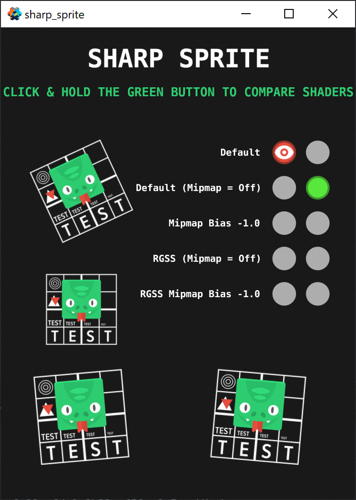

# Sharp Sprite - RGSS for Defold

Sharp Sprite is the implementation of *Rotated Grid Super-Sampling (RGSS)* for the [Defold](https://defold.com/) engine. If you use down-scaled high-resolution images in your game and you want to get rid of blurriness (because of mipmapping) or sharpness (because of disabled mipmapping), then RGSS is for you.

How does it work? RGSS samples the texture multiple times with an offset on each sample and averages the results. For this, it uses a 4x MSAA rotated grid pattern, sometimes called 4 rooks.

The second solution, that included in this repo, uses *mip biasing*. Mip biasing tells the GPU to adjust what mip level to use. The shaders use mip bias of -1.0 that pushes the mip level one full mip back to make 2D sprites look much sharper.

Also, **[check out the demo](https://indiesoftby.github.io/defold-sharp-sprite/)**. Feel free to ask questions [in the Defold forum topic](https://forum.defold.com/t/sharp-sprite-rgss-for-defold/66840).

## Installation

You can use it in your own project by adding this project as a [Defold library dependency](http://www.defold.com/manuals/libraries/). Open your `game.project` file and in the dependencies field under project add the ZIP file of a [specific release](https://github.com/indiesoftby/defold-sharp-sprite/releases).

Sharp Sprite contains a collection of materials that are a drop-in replacement for the standard 2D materials:
- **Mipmap Bias -1.0**: almost as fast as the standard materials. Use this first. If it fits your project well, keep it and don't try RGSS at all. Not suitable, if you use Slice-9 (will blur around the edges).
- **RGSS**: slow, and requires OES_standard_derivatives (see below), and doesn't require mipmaps.
- **RGSS Mipmap Bias -1.0**: faster than RGSS, but requires mipmaps. Not suitable, if you use Slice-9 (will blur around the edges).

| Type | Defold Material | Sharp Sprite Material |
| ---- | --------------- | --------------------- |
| **Mipmap Bias -1.0** | | |
| GUI  | `/builtins/materials/gui.material` | `/sharp_sprite/mipmap_bias/materials/gui.material` |
| ParticleFX  | `/builtins/materials/particlefx.material` | `/sharp_sprite/mipmap_bias/materials/particlefx.material` |
| Spine  | `/defold-spine/assets/spine.material` | `/sharp_sprite/mipmap_bias/materials/spine.material` |
| Sprite  | `/builtins/materials/sprite.material` | `/sharp_sprite/mipmap_bias/materials/sprite.material` |
| Tilemap  | `/builtins/materials/tile_map.material` | `/sharp_sprite/mipmap_bias/materials/tile_map.material` |
| **RGSS** | | |
| GUI  | `/builtins/materials/gui.material` | `/sharp_sprite/rgss/materials/gui.material` |
| ParticleFX  | `/builtins/materials/particlefx.material` | `/sharp_sprite/rgss/materials/particlefx.material` |
| Spine  | `/defold-spine/assets/spine.material` | `/sharp_sprite/rgss/materials/spine.material` |
| Sprite  | `/builtins/materials/sprite.material` | `/sharp_sprite/rgss/materials/sprite.material` |
| Tilemap  | `/builtins/materials/tile_map.material` | `/sharp_sprite/rgss/materials/tile_map.material` |
| Font (Bitmap)  | `/builtins/fonts/font.material` | `/sharp_sprite/rgss/fonts/font.material` or `/sharp_sprite/rgss/fonts/font-singlelayer.material` |
| Font (BMFont)  | `/builtins/fonts/font-fnt.material` | `/sharp_sprite/rgss/fonts/font-fnt.material` |
| Label (Bitmap)  | `/builtins/fonts/label.material` | `/sharp_sprite/rgss/fonts/label.material` or `/sharp_sprite/rgss/fonts/label-singlelayer.material` |
| Label (BMFont)  | `/builtins/fonts/label-fnt.material` | `/sharp_sprite/rgss/fonts/label-fnt.material` |
| **RGSS Mipmap Bias -1.0** | | |
| GUI  | `/builtins/materials/gui.material` | `/sharp_sprite/rgss_bias/materials/gui.material` |
| ParticleFX  | `/builtins/materials/particlefx.material` | `/sharp_sprite/rgss_bias/materials/particlefx.material` |
| Spine  | `/defold-spine/assets/spine.material` | `/sharp_sprite/rgss_bias/materials/spine.material` |
| Sprite  | `/builtins/materials/sprite.material` | `/sharp_sprite/rgss_bias/materials/sprite.material` |
| Tilemap  | `/builtins/materials/tile_map.material` | `/sharp_sprite/rgss_bias/materials/tile_map.material` |

## Notes

- If you use Slice-9 in GUI or for sprites, **use RGSS material in that case**, i.e. without mipmaps.
- RGSS requires the [OES_standard_derivatives](https://www.khronos.org/registry/OpenGL/extensions/OES/OES_standard_derivatives.txt) OpenGL extension to run. It's universally supported by WebGL 1.0, by the most of OpenGL ES 2.0 devices ([Android stats](https://opengles.gpuinfo.org/listreports.php?extension=GL_OES_standard_derivatives) and by all [iOS devices](https://developer.apple.com/library/archive/documentation/OpenGLES/Conceptual/OpenGLESHardwarePlatformGuide_iOS/OpenGLESPlatforms/OpenGLESPlatforms.html)).
- RGSS is sampling the texture 4 times. On mobile GPUs, it can have a significant performance impact. You should always check the game performance on your target devices!
- RGSS is blurring at 1:1 scaling.
- RGSS doesn't use mipmapped textures. You can turn off the mipmapping in your texture profile and save 30% of disk space. 
- If your sprites use both Defold standard and Sharp Sprite materials, then it's a good idea to split them by tags to avoid breaking of draw batching:
   1. Copy Sharp Sprite material to your project and [apply tag `tile_rgss` into it.](tile_rgss_1.png)
   2. [Modify your render script to draw the tagged sprites.](tile_rgss_2.png)

## Credits

Based on an original idea by Ben Golus - **[Sharper Mipmapping using Shader Based Supersampling](https://medium.com/@bgolus/sharper-mipmapping-using-shader-based-supersampling-ed7aadb47bec)**.

The snake image is from [Kenney](https://kenney.nl/).
